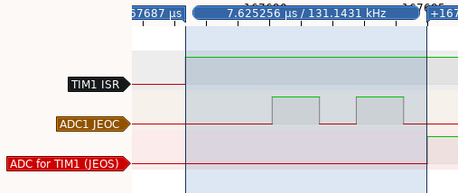

# ADC Example

This example uses the injected ADC1 associated to a timer hardware trigger:

## TIM1
TIM1 is set to generate an ISR each 1s:

 * The TRGO2 (trigger output) is associated to the Update event (overflow).

## ADC1
ADC1 is configured to read the T° and VBat (2 internal adc values), with:
* injected channels (2 conversions)
* clock is synchronous, to remove clock domain resynchronization
* hardware trigger associated to TIM1

## App
The application is interrupt driven:
* TIM1 overflows => it starts the ADC conversion sequence
* The ADC1 performs the 2 conversions, an ISR is set after each conversion for debug
* the TIM1 ISR (less priority) waits for the end of the sequence and prints the values on the serial line.

The sequence shows the TIM1 ISR, preempted 2 times by the ADC conversions (full sequence). After the last conversion JEOS (inJected End Of Sequence) is set, so that converted values could be used.

